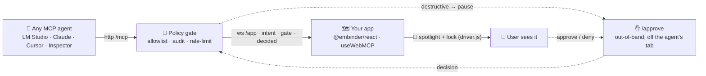
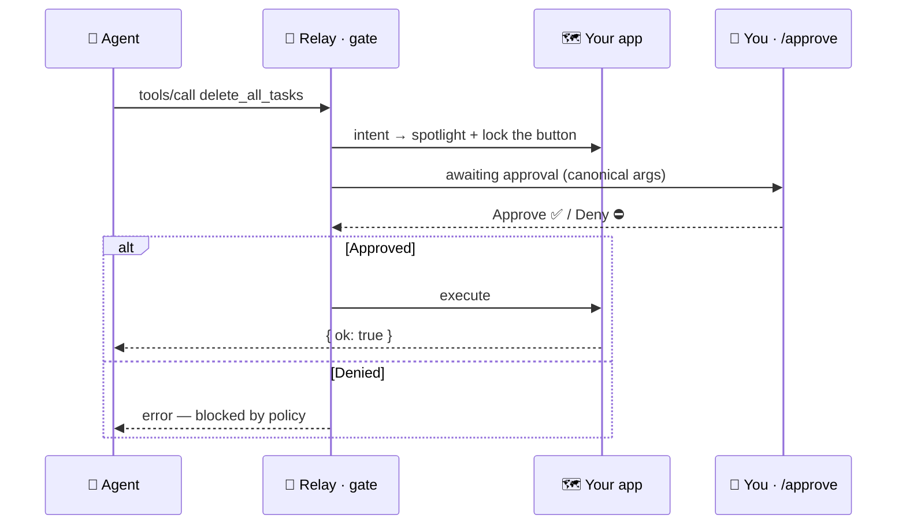

<p align="center">
  
</p>

<p align="center">
  
</p>

<h1 align="center">Embinder</h1>

<p align="center">
  <b>A map for agents to drive your app — with a human gate they can't skip.</b><br/>
  <sub>WebMCP-native SDK &nbsp;·&nbsp; server-side policy gate &nbsp;·&nbsp; live action spotlight</sub>
</p>

<p align="center">
  
  
  
  
  
  
  
  
</p>

<p align="center">
  <a href="#-quick-start"><b>Quick start</b></a> &nbsp;·&nbsp;
  <a href="#-how-it-works"><b>How it works</b></a> &nbsp;·&nbsp;
  <a href="#-the-gate-seen"><b>The gate</b></a> &nbsp;·&nbsp;
  <a href="#-how-it-compares"><b>Compare</b></a> &nbsp;·&nbsp;
  <a href="#-faq"><b>FAQ</b></a>
</p>

<!--
  Demo GIF: record the ~12s flow (agent calls delete_all_tasks → button locks → /approve → runs)
  with `vhs assets/demo.tape` (charmbracelet/vhs) or a screen recorder (Kap) → save to assets/demo.gif,
  then replace the note block below with:
  <p align="center"></p>
-->
<p align="center">
  <sub>🎬 <b>Demo recording in progress.</b> Meanwhile, watch the whole gate fire headlessly in ~3s: <code>npm run e2e</code> — or read the <a href="docs/DEMO.md">full walkthrough →</a></sub>
</p>

> [!NOTE]
> **Early preview (`v0.1.0`).** `D1–D7` complete and verified — `npm run e2e` runs **25 assertions** green (AC-1→AC-6; AC-7 rate-limit is manual). APIs will still move. Issues and feedback very welcome.

---

## 🗺️ What it is

Embinder is the **map an AI agent reads to drive a web app**. Your components declare their actions as tools; the agent sees them, calls them, and Embinder does three things at once:

- **🧭 Tells the agent how to interact** — every action is a WebMCP tool (`useWebMCP`), so any MCP client (LM Studio, Claude, Cursor, Inspector) discovers exactly what your platform can do.
- **🕹️ Lets the agent drive the user** — tool calls execute real UI actions in the user's own tab.
- **🔦 Lets the user see — and gate — what happened** — a live **spotlight** highlights the exact element being driven, and destructive actions **pause at a human approval gate that lives on the server, off the tab the agent controls.**

An optional in-app **chat bubble** (feature-flagged) routes one more agent through the very same gate.

The difference from client-side human-in-the-loop (e.g. CopilotKit): the approve/deny surface is **server-side and out-of-band**. The agent cannot reach the button, and the approver sees the exact **canonical bytes** that will execute — hidden/invisible Unicode stripped and flagged.

## 🧭 How it works



Everything runs locally on a single port **`127.0.0.1:7331`** — MCP at `POST/GET/DELETE /mcp`, the app attaches over `ws://…/app`, and the human approves at `/approve`. No cloud, one `npx`.

## 📦 Packages

| Package | Role |
|---|---|
| **`@embinder/react`** | App SDK. `EmbinderProvider` (installs a `document.modelContext` shim over ws), re-exported `useWebMCP`, `grabAnchor`, and the driver.js action **spotlight** (feature-flagged, code-split). |
| **`@embinder/relay`** | MCP server + ws hub + **policy gate**: per-session `McpServer`, approval surface, audit log, rate limit, token/origin hardening. |
| **`apps/todo`** | Reference app — a todo board exposing **6 tools** (2 destructive), wired end-to-end. |

> [!NOTE]
> Package names shown as `@embinder/*` are the published target scope. This is an `npx`-first monorepo — clone it and run the commands below; you don't need the packages off npm to try it.

## ⚡ Quick start

```bash
npm install
npm run dev        # relay :7331 + todo :5173 together
#   app:       http://localhost:5173
#   approvals: http://127.0.0.1:7331/approve   ← keep on a second window
```

Point any MCP client at `http://127.0.0.1:7331/mcp` (see [`mcp.json`](mcp.json) for the LM Studio config).

> [!TIP]
> Prove the whole pipeline **headlessly — no LLM, no browser needed**:
> ```bash
> npm run e2e      # ✅ E2E + GATE GREEN  (25 assertions, AC-1..AC-6)
> ```

## 🧩 Declaring an action (app side)

```tsx
import { useWebMCP, grabAnchor } from '@embinder/react';

useWebMCP({
  name: 'delete_all_tasks',
  description: 'Delete every task on the board',
  inputSchema: {},
  annotations: { title: 'Clear board', destructiveHint: true }, // → gate pauses this
  handler: async () => { dispatch({ type: 'CLEAR' }); return { ok: true }; },
});

<button {...grabAnchor('delete_all_tasks')}>Clear all</button>  // spotlight anchors here
```

## ⚙️ Configuration

Risk is **authoritative in [`embinder.policy.json`](embinder.policy.json)** — it wins over the app's `destructiveHint`, and unknown tools are **deny-by-default**.

```jsonc
{
  "unknownTool": "destructive",          // anything not listed → must be approved
  "tools": {
    "list_tasks":       "read",          // pass through
    "add_task":         "write",         // pass through
    "toggle_task":      "write",
    "edit_task":        "write",
    "delete_task":      "destructive",   // ⏸ pause at the gate
    "delete_all_tasks": "destructive"    // ⏸ pause at the gate
  },
  "rateLimit": { "perToolPerMin": 30 }
}
```

`read` / `write` pass through; `destructive` pauses for human approval; unknown tools are denied. `destructiveHint` from the app is only a default the policy can override.

## 🚦 The gate, seen

When an agent calls a destructive tool, the owning element is **spotlit and locked** (you can't even click it by hand), a popover shows the canonical args and a link to the approval page, and the call **hangs** until a human decides on `/approve`.



Every call is written to `audit.jsonl` with approver and latency.

> [!IMPORTANT]
> **Embinder is a *governance* layer, not a prompt-injection defense.** The gate enforces least-privilege, out-of-band destructive-action approval, per-identity authz, rate limits, and a tamper-evident audit trail — it **reduces blast radius and gives you control and visibility.** It does **not** stop tool poisoning or indirect prompt injection; those manipulate the agent's own reasoning, upstream of the relay. Anyone selling "agent security" that stops injection is overselling — we won't.

## 🆚 How it compares

|  | Traditional MCP | CopilotKit | **Embinder** |
|---|:---:|:---:|:---:|
| Tools come from | hand-written server | in-app actions | **your live UI** (WebMCP) |
| A tool acts on | a backend | your app | **the user's live tab** |
| User sees the action | ❌ | partial | ✅ **spotlight** |
| Human approval | hints only | client-side (skippable) | **server-side, out-of-band** |
| Runtime | your servers | their runtime | **`npx`, local, no cloud** |

<p align="center"><sub><b>Traditional MCP wires an agent to your backend. Embinder wires it to your user's live screen — with a bouncer the agent can't bribe and a spotlight the user can't miss.</b></sub></p>

## ❓ FAQ

<details>
<summary><b>Does the gate stop prompt injection / tool poisoning?</b></summary>

No — and we say so loudly (see the note above). Those attacks live in the agent's reasoning, upstream of the relay. Embinder limits *what an action can do and whether it runs at all*, with an audit trail. It's governance and blast-radius control, not an injection firewall.
</details>

<details>
<summary><b>Do I need the cloud or an API key?</b></summary>

No. The relay runs locally via `npx` on `127.0.0.1`. Any MCP client — including a fully local one like LM Studio — connects to it. Nothing leaves your machine.
</details>

<details>
<summary><b>Which agents work?</b></summary>

Anything that speaks MCP over Streamable HTTP: LM Studio, Claude, Cursor, MCP Inspector, and more. The SDK is also WebMCP-native, so when the browser exposes <code>document.modelContext</code> your tools register there too.
</details>

<details>
<summary><b>Isn't this just CopilotKit?</b></summary>

No. CopilotKit embeds an agent in your app and runs human-in-the-loop <i>in the browser</i> — a script can approve itself. Embinder is for <i>external</i> agents and enforces approval on the server, off the tab the agent controls.
</details>

## 🛠️ Status

`D1–D7` complete and verified — `npm run e2e` runs **25 assertions** green (AC-1→AC-6; AC-7 rate-limit is manual). See [`BUILD_STATUS.md`](BUILD_STATUS.md) for the per-task map and [`docs/DEMO.md`](docs/DEMO.md) for the acceptance + rehearsal playbook.

## 🤝 Contributing

Early preview — issues, ideas, and PRs are welcome.

```bash
git clone https://github.com/celesnity/Embinder.git
cd Embinder && npm install
npm run e2e        # make sure the gate is green before you start
npm run dev        # relay :7331 + todo :5173
```

Please keep `npm run e2e` green and add an assertion when you change gate behavior. Open an issue first for anything that touches the policy model or the approval surface.

## 🧱 Built with

[WebMCP](https://github.com/webmachinelearning/webmcp) · [`@modelcontextprotocol/sdk`](https://github.com/modelcontextprotocol/typescript-sdk) · [driver.js](https://github.com/kamranahmedse/driver.js) · [Vite](https://vitejs.dev) · [React](https://react.dev) · zod · express · ws

## 📄 License

MIT (intended). Reference sources under `.references/` are third-party and not distributed.

<p align="center">
  <sub>Built in the open. An agent should read your app like a map — and you should always hold the pen. 🗺️</sub>
</p>
