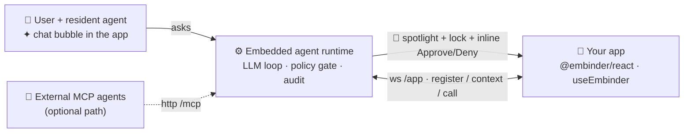
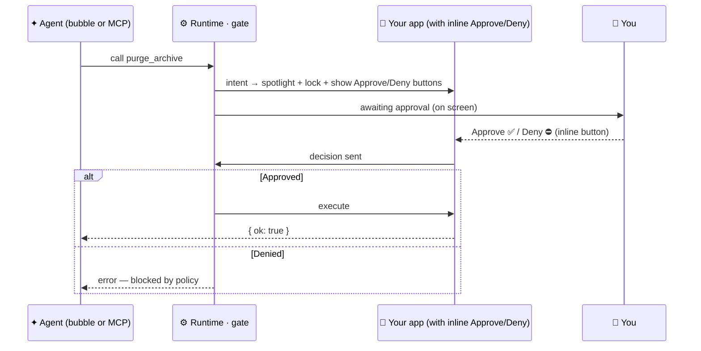

<p align="center">
  
</p>

<h1 align="center">Embinder</h1>

<p align="center">
  <b>Drop a pointer on your components and the agent moves in — it sees the screen the user sees and operates it natively.</b><br/>
  <sub>one-hook pointer SDK &nbsp;·&nbsp; render-scoped agent context &nbsp;·&nbsp; server-side approval gate &nbsp;·&nbsp; no connector, no separate tool server</sub>
</p>

<p align="center">
  
  
  
  
  
  
  
</p>

<p align="center">
  <a href="#-the-idea"><b>The idea</b></a> &nbsp;·&nbsp;
  <a href="#-quick-start"><b>Quick start</b></a> &nbsp;·&nbsp;
  <a href="#-the-pointer"><b>The pointer</b></a> &nbsp;·&nbsp;
  <a href="#-the-gate-seen"><b>The gate</b></a> &nbsp;·&nbsp;
  <a href="#-how-it-compares"><b>Compare</b></a> &nbsp;·&nbsp;
  <a href="#-faq"><b>FAQ</b></a>
</p>

> [!NOTE]
> **Early preview (`v0.1.0`).** `npm run e2e` runs **36 assertions** green, covering the pointer lifecycle, the render-scoped context switch, bound state, grace semantics, and the full approval gate. APIs will still move. Issues and feedback very welcome.

---

## 💡 The idea

Every agent-on-app system drowns the model in "here are all 300 tools" — context bloat, wrong-tool selection, latency. And MCP-style integrations wire a *separate* agent to your app over a connector, blind to what the user is actually looking at.

Embinder makes the agent a **resident of the app**. The primitive is a pointer — the `useEmbinder` hook — attached to a UI element in your existing code. Attaching it does two things at once:

- **🫧 Legibility** — while that element is rendered, its existence, its function, and (optionally) the state it displays enter the agent's live context automatically. The agent sees what the user sees.
- **🕹️ Actionability** — the agent invokes the bound function directly. Real handlers, structured arguments — not pixel clicking.

And the part that matters most: **context is scoped to the current display.** Button on screen → the agent knows it. User navigates away → it drops out of context; whatever's on the new page loads in. The agent only ever holds the handful of actions in front of the user — smaller context, higher accuracy, lower cost, and it maps exactly to how a human uses software: *you can only click what's in front of you.*

## ⚡ Quick start

```bash
npm install

# tell the embedded runtime which model to use (key stays server-side too)
LLM_BASE_URL=http://127.0.0.1:1234/v1 LLM_MODEL=qwen2.5-7b-instruct npm run dev
#   app + resident agent bubble:  http://localhost:5173
#   approvals:                    on-screen in the app tab (Approve/Deny inline buttons)
```

Open the app, click the ✦ bubble, and ask for something on the screen. Switch to the Archive page and watch the agent's world change with yours.

> [!TIP]
> Prove the whole pipeline **headlessly — no LLM, no browser needed**:
> ```bash
> npm run e2e      # ✅ E2E + GATE GREEN  (36 assertions)
> ```

## 🫧 The pointer

One call registers the capability while the component is mounted, anchors it to the element, and unregisters when it unmounts. That's the entire integration:

```tsx
import { useEmbinder } from '@embinder/react';

const addBind = useEmbinder({
  name: 'add_task',
  description: 'Add a new task to the board',
  input: { text: z.string().describe('Task text') },
  handler: async ({ text }) => { dispatch({ type: 'ADD', text }); return { ok: true }; },
});

<button {...addBind} onClick={add}>Add</button>
```

A pointer can also expose what the element *shows*, so the agent reads the screen instead of calling `list_*` tools:

```tsx
// context-only pointer: no handler → never a callable tool, purely legibility
const boardBind = useEmbinder({
  name: 'task_board',
  description: 'The task board the user is looking at',
  context: () => ({ openTasks }),   // live, read-only, debounced
});

<section {...boardBind}>…</section>
```

Each agent turn starts with exactly what's mounted right now — an "On-screen now" block with the capabilities and their bound state. Navigate, and the next turn sees the new page instead. Mid-task navigation is safe too: in-flight calls get a ~2 s grace window (quick tab flips survive), then fail with a clean `capability left the screen` error the agent can react to.

## 🧭 How it works



Everything runs locally on a single port **`127.0.0.1:7331`**. The relay is the app's embedded agent runtime: it hosts the LLM loop for the bubble (`/chat`, config from env via `/chat-config`), holds the live capability registry, and gates every call. No cloud, one `npx`.

## 📦 Packages

| Package | Role |
|---|---|
| **`@embinder/react`** | App SDK. `useEmbinder` (the pointer), `EmbinderProvider` (ws shim + default-mounted resident bubble), driver.js action **spotlight** (feature-flagged, code-split). |
| **`@embinder/relay`** | Embedded agent runtime: capability registry with render-scoped membership, `/chat` LLM loop, **policy gate**, approval surface, audit log, rate limit, token/origin hardening. Optional `/mcp` endpoint for external agents. |
| **`apps/todo`** | Reference app — two pages (Board ⇄ Archive) whose point is watching the agent's context switch when you navigate. |

> [!NOTE]
> Package names shown as `@embinder/*` are the published target scope. This is an `npx`-first monorepo — clone it and run the commands; you don't need the packages off npm to try it.

## ⚙️ Configuration

Risk is **authoritative in [`embinder.policy.json`](embinder.policy.json)** — it wins over the pointer's `destructive` flag, and unknown tools are **deny-by-default**.

```jsonc
{
  "unknownTool": "destructive",          // anything not listed → must be approved
  "tools": {
    "task_board":       "read",          // context-only pointer (never callable anyway)
    "add_task":         "write",         // pass through
    "restore_task":     "write",
    "delete_task":      "destructive",   // ⏸ pause at the gate
    "purge_archive":    "destructive"    // ⏸ pause at the gate
  },
  "rateLimit": { "perToolPerMin": 30 }
}
```

The bubble's model config lives in the relay's environment, next to the key: `LLM_BASE_URL`, `LLM_MODEL`, `LLM_KEY`. App code carries zero LLM config; an unconfigured relay shows a "connect a model" hint in the bubble.

## 🚦 The gate, seen

A resident agent operating real handlers makes governance *more* necessary, not less. When any agent — bubble or external — calls a destructive capability, the owning element is **spotlit and locked**, a popover shows the canonical args with inline Approve/Deny buttons on screen, and the call **hangs** until a human decides.



Every call is written to `audit.jsonl` with approver and latency. Bound state flowing into the model's prompt is delimited and labeled as display data — but the security boundary is the gate, not the prompt.

> [!IMPORTANT]
> **Embinder is a *governance* layer, not a prompt-injection defense.** The gate enforces least-privilege, out-of-band destructive-action approval, rate limits, and a tamper-evident audit trail — it **reduces blast radius and gives you control and visibility.** It does **not** stop tool poisoning or indirect prompt injection; those manipulate the agent's own reasoning, upstream of the runtime. Anyone selling "agent security" that stops injection is overselling — we won't.

## 🆚 How it compares

|  | Traditional MCP | CopilotKit | **Embinder** |
|---|:---:|:---:|:---:|
| The agent lives | outside, over a connector | in your app | **in your app** |
| Tools come from | hand-written server | in-app actions | **your live UI** (one hook) |
| Agent's context holds | the whole catalog | registered actions | **only what's on screen** |
| Agent reads app state | extra read tools | partial | **bound state, automatic** |
| Human approval | hints only | client-side (skippable) | **server-side, out-of-band** |
| Runtime | your servers | their runtime | **`npx`, local, no cloud** |

<p align="center"><sub><b>The agent that only knows what's on the screen — like a user, not like an API.</b></sub></p>

## ❓ FAQ

<details>
<summary><b>Is this MCP?</b></summary>

No — the product is the resident agent. The app and runtime speak their own minimal protocol (`register / context / call / result` over a local ws). An MCP endpoint (<code>/mcp</code>) is kept as an <i>optional</i> path if you deliberately want a separated agent (LM Studio, Claude, Cursor, Inspector) to drive the same capabilities through the same gate.
</details>

<details>
<summary><b>Why scope context to the screen?</b></summary>

Because flat tool catalogs don't scale: selection accuracy drops and cost grows with tool count. Render-scoping solves it structurally — the context is small <i>by construction</i>, and the pruning heuristic (what's on screen) is the one your app's designers already encoded when they decided what to show the user.
</details>

<details>
<summary><b>What happens if the user navigates mid-task?</b></summary>

In-flight calls get a ~2 s grace window — a quick remount re-delivers them; otherwise they fail fast with <code>capability left the screen</code>, pending approvals for the vanished capability are cancelled (audited as <code>unmounted</code>), and the agent's next turn sees the new page.
</details>

<details>
<summary><b>Do I need the cloud or an API key?</b></summary>

No. The runtime is local (`127.0.0.1`), and the bubble works with any OpenAI-compatible endpoint — including a fully local one like LM Studio. Keys and model config stay in the runtime's environment, never in app code or the browser.
</details>

<details>
<summary><b>Does the gate stop prompt injection / tool poisoning?</b></summary>

No — and we say so loudly (see the note above). Those attacks live in the agent's reasoning, upstream of the runtime. Embinder limits *what an action can do and whether it runs at all*, with an audit trail.
</details>

## 🛠️ Status

Pointer primitive, render-scoped context, bound state, grace semantics, resident bubble, and the full gate are implemented and verified — `npm run e2e` runs **36 assertions** green. See [`BUILD_STATUS.md`](BUILD_STATUS.md) for the per-task map and [`docs/DEMO.md`](docs/DEMO.md) for the walkthrough.

## 🤝 Contributing

Early preview — issues, ideas, and PRs are welcome.

```bash
git clone https://github.com/celesnity/Embinder.git
cd Embinder && npm install
npm run e2e        # make sure the gate is green before you start
npm run dev        # runtime :7331 + todo :5173
```

Please keep `npm run e2e` green and add an assertion when you change pointer or gate behavior. Open an issue first for anything that touches the policy model or the approval surface.

## 🧱 Built with

[`@modelcontextprotocol/sdk`](https://github.com/modelcontextprotocol/typescript-sdk) · [Vercel AI SDK](https://sdk.vercel.ai) · [assistant-ui](https://github.com/assistant-ui/assistant-ui) · [driver.js](https://github.com/kamranahmedse/driver.js) · [Vite](https://vitejs.dev) · [React](https://react.dev) · zod · express · ws

## 📄 License

MIT (intended). Reference sources under `.references/` are third-party and not distributed.

<p align="center">
  <sub>Built in the open. The agent should live where the user lives — and you should always hold the pen. 🫧</sub>
</p>
